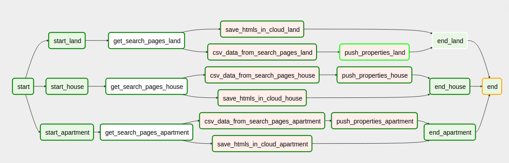

# airflow_scrapper

This projects is about get real state data from local companies, and save it in our local db in order to make analysis with that.

Under the hood use airflow, redis, cellery, postgres and selenium.

The main flow:

## Deploy

### Create airflow docker image:

`docker build -t docker_airflow -f Dockerfile-airflow .`

### Create selenium docker image:

`docker build -t docker_selenium -f Dockerfile-selenium .`
`sudo chown ubuntu:ubuntu /var/run/docker.sock`

### Networks and shared volumes

Like our system has a lot of components(redis, postgres db, cellery workers) we need a network to connect al this components:

`docker network create airflow_scrapper_default`

`docker volume create --name=downloads`
